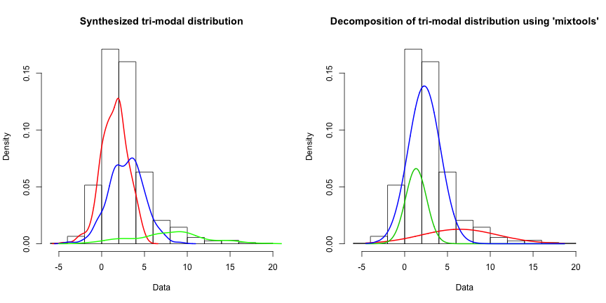

## What are multi-mode distributions?
1.	Multi-mode distributions the have more than one ‘mode’.  
2.	They are typically composed of several component distributions, each with their own mean and standard deviation.
3.	The resulting ‘shape’ of the distribution depends on the relative proportions (number of points) of each of the component distributions
4.	They are common in 'natural populations' but problematic to deal with

--- .class #id 

## The R ‘mixtools’ package:
1.	The mixtools package takes an input distribution as an argument
2.	The ‘normalmixEM’ function can be used to decompose a distribution to ‘normal distribution’ components.
3.	You can specify the number of modes you want to investigate
4.	You can specify the number of iterations
5.	It works best with larger datasets

--- .class #id 

## Analysis example:

A tri-modal distribution was synthesised from 10,000 data points randomly sampled from three normally distributed populations in the following component proportions 50%, 40% and 10%).



--- .class #id 

## Results
The input parameters of the component distributions are:

```r
comp.proportions <- c(5000, 4000, 1000)
comp.means <- c(1.5, 3, 8)
comp.stdevs <- c(1.5, 2, 4)
```
The output of the ‘normalmixEM” function is:

```
## summary of normalmixEM object:
##          comp 1   comp 2     comp 3
## lambda 0.698029 0.280438  0.0215324
## mu     1.516243 3.500708 11.1238884
## sigma  1.523845 1.926194  1.8987278
## loglik at estimate:  -2026.697
```
Interactive shiny app here: https://jameselvy.shinyapps.io/CourseraDataProductsShiny/

Source code: https://github.com/jameselvy/DataProductsShiny
