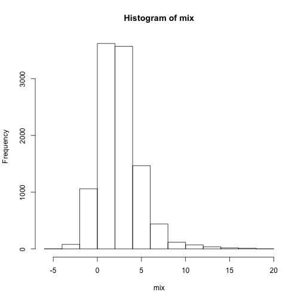
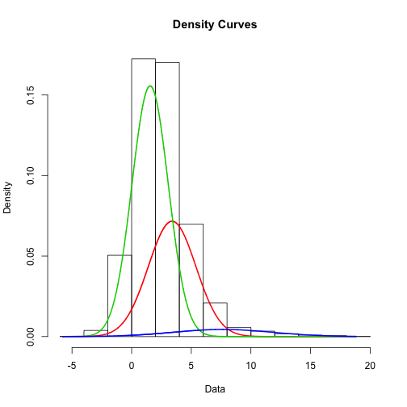

## Read-And-Delete

1. Edit YAML front matter
2. Write using R Markdown
3. Use an empty line followed by three dashes to separate slides!

--- .class #id 

## Slide 2
WARNING! NOT CONVERGENT! 
number of iterations= 1000 
summary of normalmixEM object:
        comp 1   comp 2    comp 3
lambda 0.35884 0.595121 0.0460392
mu     3.39354 1.550057 7.6441309
sigma  2.00002 1.526222 4.1583473
loglik at estimate:  -22998.35 
        percent mean  sd mix.percent mix.mean mix.sd
Sample1      48  1.5 1.5          36     3.39   2.00
Sample2      48  3.0 2.0          60     1.55   1.53
Sample3       5  8.0 4.0           5     7.64   4.16

```
## Error in sort(x[complete.cases(x)]): object 'mixMode' not found
```


